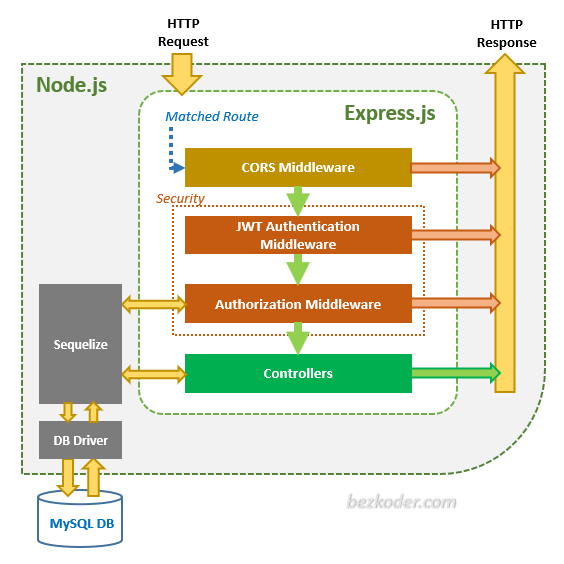

# Médulos usados
``npm i express``

``npm i compression``

``npm i morgan``

## Módulo para desarrollo
npm install kill-port --save-dev
## Nodemon avanzado (error en puerto abierto)
https://stackoverflow.com/questions/58605392/port-3000-is-already-in-use-nodemon-app-crashed-waiting-for-file-changes-bef

## Ejecución de script
npm run start-dev

## Arquitectura de NodeJs y los middlewares
### Formato simplificado

### Formato detallado

### NodeJs Express: Seguridad

